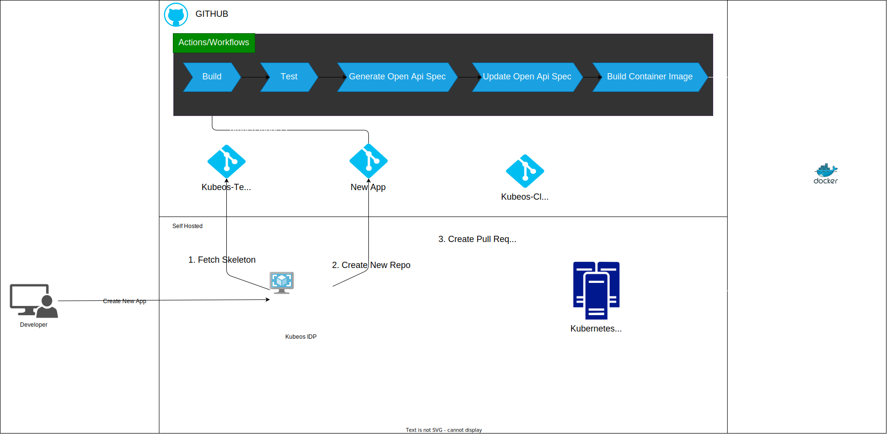

# [Kubeos](https://backstage.io)

# KubeOS Developer Portal Documentation

Welcome to the KubeOS Developer Portal, your one-stop platform for Kubernetes-based application development and management.


# Kubeos: Streamlining Development with Kubernetes

Kubeos is a comprehensive internal developer platform designed to streamline the software development process within organizations. It empowers developers and managers by providing a unified environment for managing resources, deploying applications, and ensuring the efficiency and security of the development lifecycle.



<!--  -->

## Key Features

### Kubernetes Integration

- **Kubernetes Power:** Kubeos leverages the power of Kubernetes for resource deployment and management. This ensures that all resources are managed according to best DevOps practices.

### Flux for Repository Synchronization

- **Repository Sync:** Flux is used to synchronize repositories, with a dedicated `kubeos-cluster` repository for managing resources using Kubernetes Kustomization.

### GitHub Actions

- **Automation:** GitHub Actions automates various development pipeline tasks, including building, testing, and generating OpenAPI specifications. This ensures consistency and reliability in the development process.

### Standardization

- **Consistency:** Kubeos helps establish and maintain development standards within the organization. This ensures that all projects adhere to the same practices and guidelines.

### Backstage Feature Catalog

- **Unified Platform:** Kubeos integrates with Backstage, providing a feature catalog that serves as a central hub for developers and managers to access and manage all resources in one place.

### Dependency Tracking

- **Visualizing Dependencies:** The platform offers a map view plugin to track dependencies at different hierarchy levels. Users can easily see which APIs a component consumes and which other APIs consume it.

### Secret Management

- **Secure Storage:** Kubeos keeps track of secrets stored in a secure vault for each service. This ensures that sensitive information is well-protected and can be accessed by authorized users only.

### Pipeline Monitoring

- **Visibility:** Kubeos provides comprehensive visibility into pipeline states and logs. Users can easily monitor the progress of their applications and identify and address any issues promptly.

### Documentation and Readme

- **Access to Information:** Technical documentation and readmes are readily available for components. This allows users to access all the information they need to work with the components efficiently.

### Pod Interaction

- **Troubleshooting Made Easy:** Users can execute commands within pods, view logs, and perform other pod-related actions. This simplifies the debugging and troubleshooting process, enhancing the overall development experience.

## Benefits

Kubeos offers a wide range of benefits for organizations:

- **Efficiency:** Streamlined processes and automation lead to more efficient development and deployment.

- **Visibility:** Comprehensive monitoring and dependency tracking enhance project visibility.

- **Security:** Centralized secret management ensures the security of sensitive information.

- **Consistency:** Standardization ensures that projects adhere to best practices.

- **Simplicity:** Access to documentation and pod interaction simplifies development and troubleshooting.

In summary, Kubeos is a powerful and extensible platform that empowers developers to create and manage Kubernetes applications effortlessly. It integrates essential tools and features into a unified ecosystem, making it a valuable asset for organizations engaged in Kubernetes-based application development.


## Overview

KubeOS is designed to streamline the Kubernetes development workflow and empower developers to create and manage Kubernetes applications effortlessly. It leverages Backstage as its foundation, along with integrated Kubernetes and Flux plugins, making it a powerful and extensible platform for your development needs.

## Features

### Backstage Integration

KubeOS is built on top of Backstage, an open-source developer portal framework. This integration offers the following benefits:

- **Service Catalog**: Discover and manage services and components easily.
- **CI/CD Pipelines**: Seamlessly integrate with CI/CD pipelines for automated deployments.
- **Documentation**: Centralized documentation management for all services and components.
- **Custom Plugins**: Extend functionality with custom plugins tailored to your needs.

### Kubernetes Support

KubeOS provides comprehensive support for Kubernetes:

- **Cluster Management**: Manage and interact with Kubernetes clusters effortlessly.
- **Resource Management**: Easily deploy, scale, and monitor Kubernetes resources.
- **Secrets Management**: Securely store and manage sensitive information.
- **Service Mesh**: Simplify microservices communication and management with Istio integration.

### Flux Plugin

KubeOS comes pre-installed with Flux, a GitOps tool for Kubernetes. With the Flux plugin, you can:

- **GitOps Workflows**: Automate Kubernetes deployments using Git repositories.
- **Continuous Delivery**: Keep your applications up to date and in sync with your Git repository.
- **Version Control**: Easily roll back to previous versions of your applications.

### Roadie Actions

KubeOS includes Roadie actions, providing you with a set of predefined actions to enhance your development process:

- **Deployment Actions**: Simplify deployments with predefined actions like "Deploy to Staging" and "Promote to Production."
- **Code Analysis**: Automate code analysis and quality checks during your CI/CD pipeline.
- **Documentation Generation**: Generate API documentation and user guides with ease.

## Getting Started

To start using KubeOS and take advantage of its powerful features, follow these steps:

1. **Access the Portal**: Visit [KubeOS Developer Portal](https://kubeos.iamsourabh.in) and log in with your credentials.

2. **Explore the Catalog**: Discover services, components, and documentation in the catalog.

3. **Deploy Applications**: Use the Kubernetes and Flux integration to deploy and manage your applications.

4. **Leverage Roadie Actions**: Take advantage of Roadie actions to automate repetitive tasks and streamline your development workflows.

## Conclusion

KubeOS is your trusted companion for Kubernetes-based development. With its seamless integration of Backstage, Kubernetes, Flux, and Roadie actions, you can accelerate your development process, maintain code quality, and effortlessly manage your Kubernetes workloads.

For any questions or assistance, feel free to reach out to our support team at [support@kubeos.example.com](mailto:support@kubeos.example.com).

Happy coding with KubeOS!


To start the app, run:

```sh
yarn install
yarn dev
```
